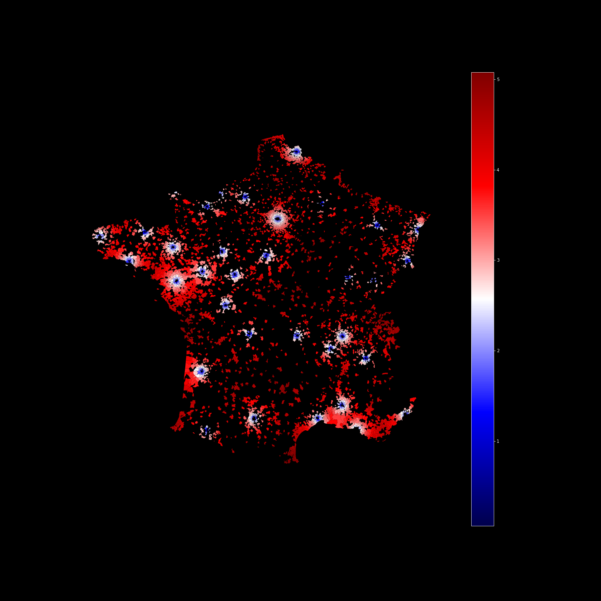
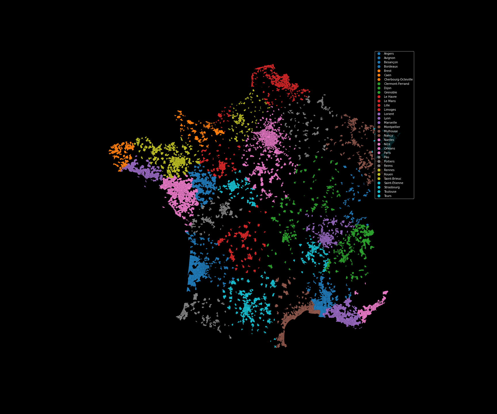
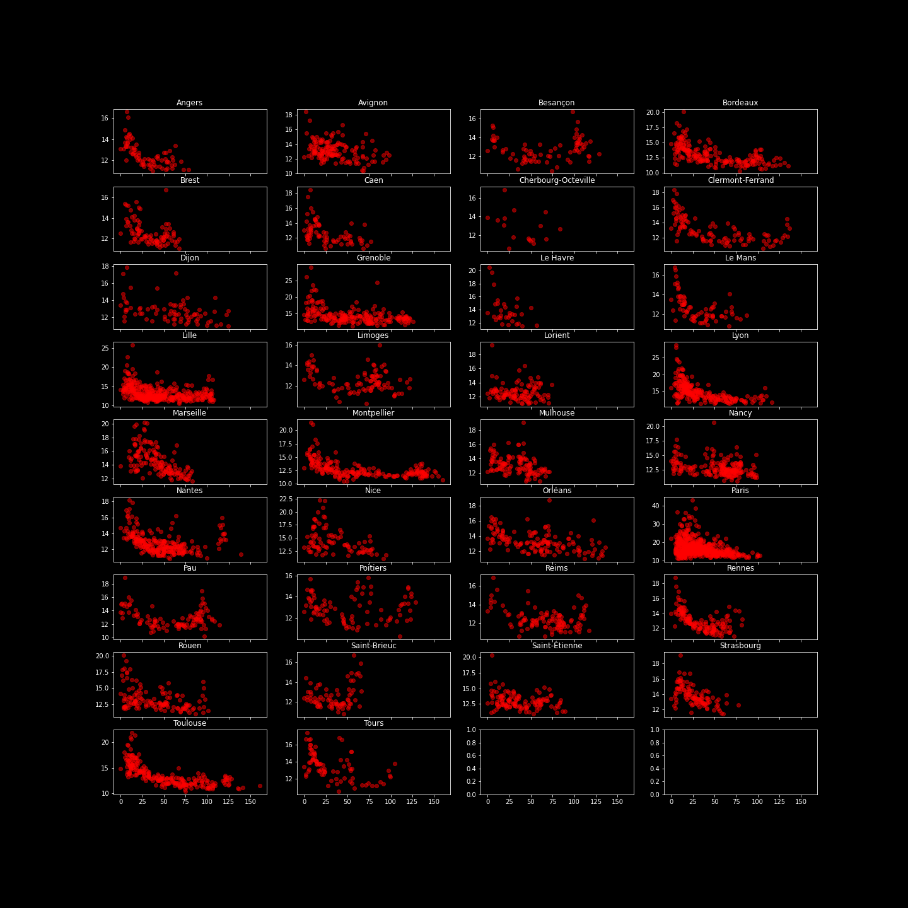
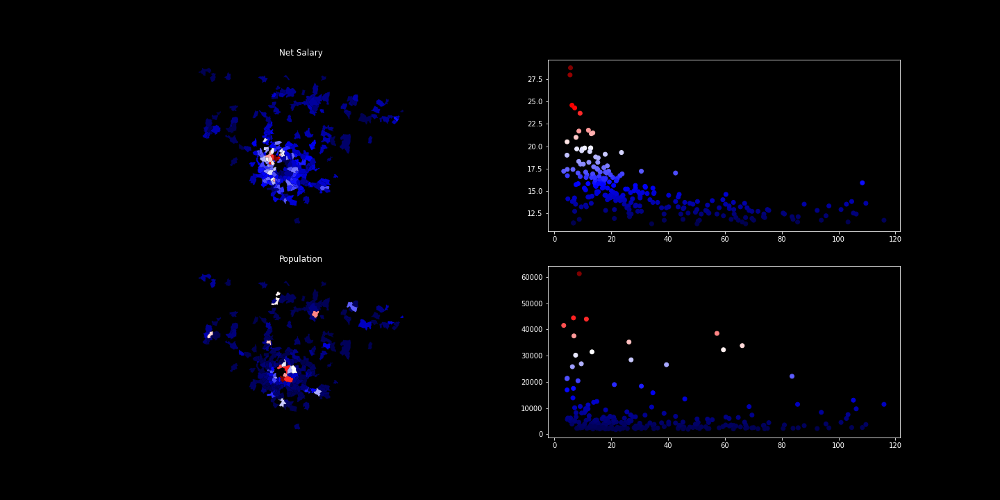
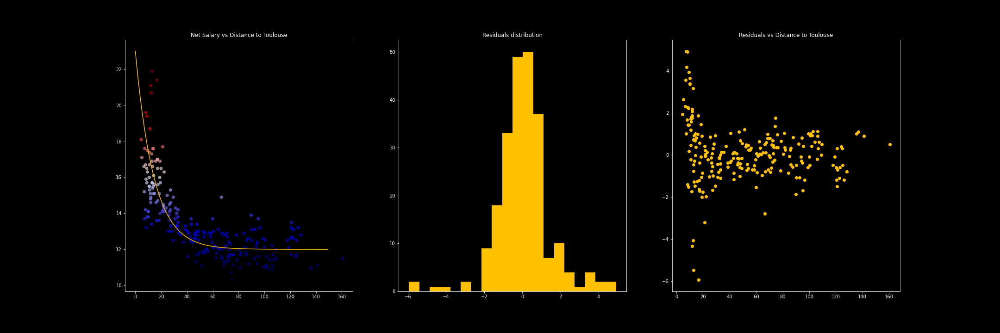

# Metropolis

In this repository, I am trying to asses an idea I had some months ago on the revenue distribution in France: high wages are found mainly in a small portion of towns. These high wages are then diffused to nearby cities in some sort of exponential fashion.

## Data sources

To perform this study, I use data from INSEE on [population](data/population.csv) and [wages](data/net_salary_per_town_categories.csv) per city. I also use a dataset containing [city shape](data/a-com2022.json) data.

> The wage dataset contains only data for cities with a population of over 2000 inhabitants which leaves us with only 5000 cities to use. I assumed that the remaining cities follow the same rules as the one that I have.

## Methodology

### Dataset creation

Once, the dataset are [merged](notebooks/01_cleaning_data.ipynb), I took apart cities from Corsica and other ultramarine regions. I assumed that their behavior is too specific.

I have identified a series of cities that are to be my main drivers of wage (I called them metropolis). This choice of towns is a bit arbitrary and might change (initially, I chose towns that had a subway or a tramway system but had to add more cities).

I [computed the distance](notebooks/02_compute_distances.ipynb) of each of my records to these cities (columns named `distance_to_{city_name}` and associated them to the nearest metropolis (`closest_metropolis` associated to the `dist_min` distance). These data is available in this [master.geojson](data/master.geojson) dataset.

This map shows the log-distance to the nearest metropolis:

This map shows the attribution of cities to metropolis:

## Study

In a [third notebook](notebooks/03_general_study.ipynb), I tried to plot the average wage as a function of the distance to the metropolis:

We can see that for some cities like Lyon or Toulouse, we can see an exponential pattern:

I decided to study a bit more these patterns. Specifically in [Toulouse study](notebooks/04_Toulouse.ipynb), I tried to fit by hand an exponential curve which matched pretty well and gave a 7% average error:

I tried to perform some other studies on other cities that you can find in the other notebooks.

## Generalization

I realized that I could speed up the process by using `for` loops and optimize directly my models for every metropolis. That is what you can find in [this notebook](notebooks/07_paris.ipynb). The scores are pretty good:

|city|score|nb_cities|alpha|y0|base|
|---|---|---|---|---|---|
|Angers|0.05|75|0.13|5|12|
|Le Mans|0.05|71|0.15|8|12|
|Brest|0.05|87|0.11|4|12|
|Rennes|0.05|143|0.09|6|12|
|Montpellier|0.05|206|0.07|5|12|
|Limoges|0.06|96|0.14|4|12|
|Nantes|0.06|245|0.06|4|12|
|Toulouse|0.06|232|0.05|7|12|
|Reims|0.06|109|0.06|4|12|
|Strasbourg|0.06|105|0.01|6|9|
|Clermont-Ferrand|0.06|104|0.09|6|12|
|Orléans|0.07|139|0.01|4|11|
|Saint-Brieuc|0.07|73|0.2|4|12|
|Saint-Étienne|0.07|120|0.01|4|10|
|Nancy|0.07|195|0.01|4|10|
|Mulhouse|0.07|116|0.01|4|10|
|Pau|0.07|102|0.07|4|12|
|Tours|0.07|78|0.06|5|12|
|Lorient|0.07|110|0.16|4|12|
|Dijon|0.07|77|0.01|4|10|
|Bordeaux|0.07|198|0.02|4|11|
|Besançon|0.07|75|0.11|4|12|
|Avignon|0.07|141|0.01|4|10|
|Lille|0.08|399|0.06|4|12|
|Le Havre|0.08|31|0.12|11|12|
|Poitiers|0.08|89|0.11|4|12|
|Caen|0.08|70|0.02|4|10|
|Marseille|0.08|145|0.01|11|7|
|Cherbourg-Octeville|0.09|16|0.04|4|11|
|Rouen|0.09|127|0.01|4|10|
|Grenoble|0.1|209|0.01|4|12|
|Lyon|0.1|240|0.04|7|12|
|Nice|0.11|86|0.01|6|10|
|Paris|0.16|620|0.01|10|9|

The scores are the mean relative absolute error (i.e. 0.16 means 16% of average error for Paris).

The formula of the model is:

$$ \text{wage} = y_0\ e^{-\alpha \times \text{distance}} + \text{base} $$

### We'll always have Paris

Paris is a bit tricky... The structure of wages is very different from other cities: the west is pretty rich but the east pretty poor (this comes from the main direction of the winds in Paris!). I will try to find some way to deal with Paris in this [notebook](notebooks/07_paris.ipynb) but I do not really have any idea for the time being apart from regarding Paris suburbs as three different metropolis areas, as if they were totally different areas. This kind of work well for the west part but not for the east part.

## What next ?

I still have some interesting ideas on how to model certain phenomena: for example, you can take a look at the plot of wage vs distance to metropolis for the city of Rennes. You can see that the wage is rising again quite far from Rennes. I think this comes from the presence of Dinard and Saint-Malo which are beautiful touristic cities but that cannot have the same impact on its surrounding as Rennes has. I imagine that they can carry some sort of influence up to 20 to 30 kms but no further. They are obviously not the sole case but identifying these cities will take some time.

### TODO

- [ ] Clean the notebooks
- [ ] Add comments to the notebooks
- [ ] Study the special case of Paris
- [ ] Add second order effects from "minor metropolis"
- [ ] Evaluate the model
- [ ] Document the data sources
- [ ] Find new data (The INSEE is to release new data in October)
- [ ] Write a nice article ?? :)

### Why not ?

- [ ] Add transportation data into the model
- [ ] Add energy consumption in the model
- [ ] Add touristic data
